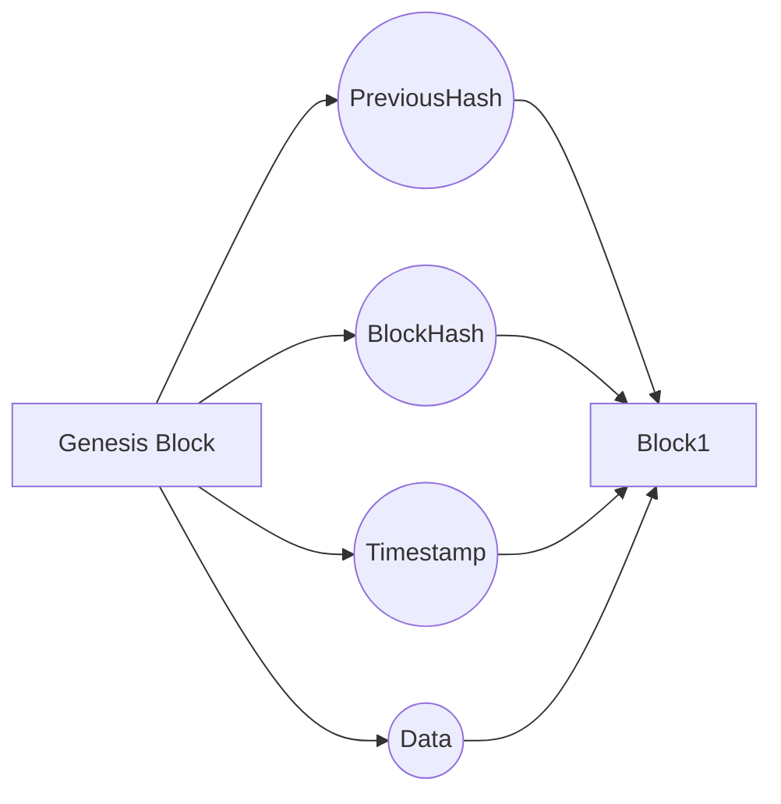

# Blockchain Analysis (Proof-Of-Work, Mining Rewards, Public Private Key Signatures)

Analysing the mechanics behind blockchain technology including hash, public private keys.

Blockchain mechanics

## Blockchain mechanics:
1. Data (Or Transasction Data) together with Timestamp saved in Block
2. Hash current Block and input Previous Hash of Previous Block into current Block
3. Push Block to Current Chain of Block (Or Genesis Block) with the Hash to chain them

## Issues to solve:
A. Too many block pushes at once by changing hash, and chaining them
B. No Incentives for Miners to validate and hash
C. Anyone can validate anyone transaction if there's no identity

## Solutions & Next Steps:

A. If there are too many blocks being pushed, we must limit that
1. Proof Of Work via Mining
2. Set Difficulty target of hash (number of zeros in front of hash)
3. Pure guesswork using nonce as only variable to find hash
4. Higher Difficulty, More Time needed to Chain, Less Likely to change all block in chain

B. If there are no financial reward, there are no miners to help validate
1. Cryptocurrency Incentives
2. Introduce 1 more transaction into PendingTransactions during Mining
3. Send MiningReward to Address of Miner once successfully hash
4. Differs from Proof of Stake

C. If there is no private key to sign the transaction, unable to validate
1. Public Private Key Signature
2. By signing hash of the block using private key, miners able to verify using public key

## Further Issues and Possible Solutions:
* Although Proof Of Work helps increase difficulty barriers to change whole blockchain data, Wealthy Miners with supercomputers and Grouping together into Mining Pools might happen
* Supercomputers from large groups have higher chances of finding Right Hash to meet difficulty target
* Proof Of Stake could solve it, miner is randomly chosen to mine and validate. Noone fights with you to validate anymore based on computational power
* Less unfair since election process, although Miners with more stake have higher chances of being chosen
